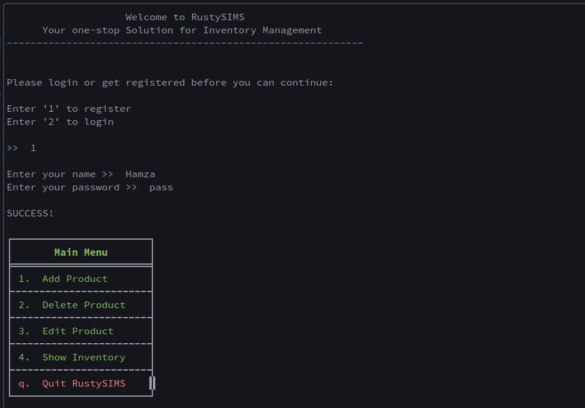
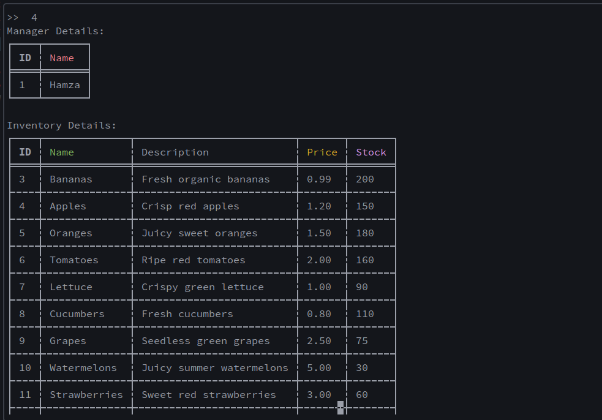
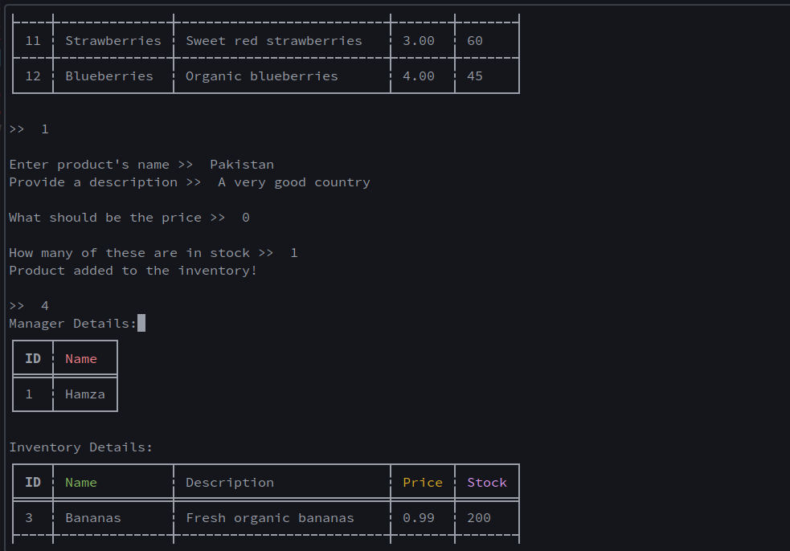
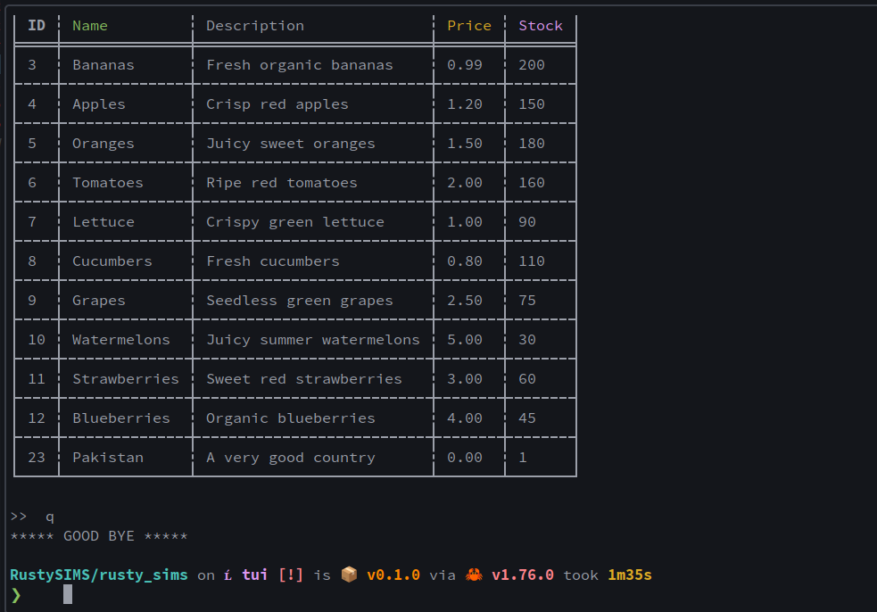

# RustySIMS: A Robust Inventory Management System


### Project Details**
RustySIMS is a command-line inventory management system designed to streamline product organization and tracking. It enables manager's with the following capabilities:

- **Product Management:** Add, delete, edit, and view detailed information about products in your inventory, including name, description, price, stock level, and manager association with beautiful and simply elegant **Table-y** structures that are easy on eyes and highly understandable.
- **Manager Accounts:** Create and manage accounts for multiple managers, ensuring secure access and potential implementation of role-based controls in the future.
- **Robust Database:** Leverage a **rusqlite** database to persistently store inventory data, guaranteeing data integrity and retrieval even after program termination.
- **Secure Password Hashing:** Employ the industry-standard **bcrypt** library to securely hash and store manager passwords, protecting sensitive information against unauthorized access.

### Vision

RustySIMS aspires to become a versatile and user-friendly inventory management solution, catering to the needs of businesses of all sizes. Its commitment to security, scalability, and efficient data handling aims to empower users with control and confidence in managing their product inventory.

**Usage**

1. **Installation:**
   - Ensure you have Rust and cargo installed:
     https://www.rust-lang.org/tools/install
     
   - Clone this repository:
     ```bash
     git clone https://github.com/HamzaMateen/RustySIMS
     ```
   - Navigate to the project directory:
     ```bash
     cd rusty_sims
     ```
   - Build the project:
     ```bash
     cargo build
     ```

2. **Running the Application:**
   - Execute the compiled binary:
     ```bash
     ./target/debug/rusty_sims
     ```

**Demo Pics**






### Thank You!
